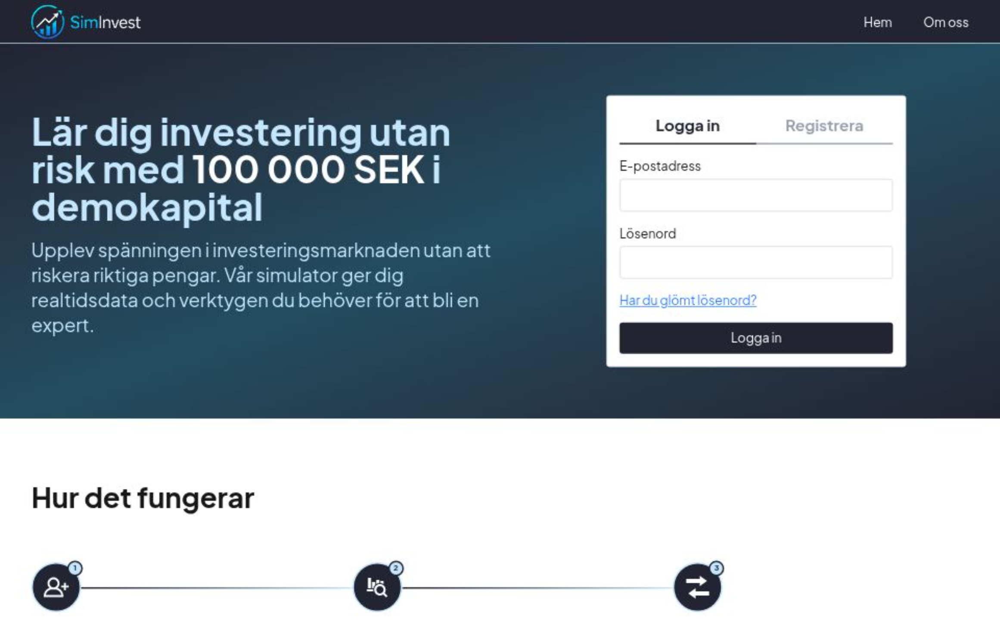

# SimInvest

SimInvest är en webbapplikation där användaren kan simulera investeringar i kryptovalutor med fiktiva pengar. Projektet är byggt som ett examensarbete inom Fullstack JavaScript och har fokus på backend, API:er, databashantering, autentisering och integration med ett externt API.

I appen kan användaren skapa konto, logga in, se tillgängliga kryptovalutor, följa aktuella priser, köpa och sälja kryptovalutor samt se sin portfölj och transaktionshistorik.



## Live demo

Appen finns publicerad här:

[Öppna SimInvest](https://siminvest.vercel.app/)

## Sammanfattning

Syftet med SimInvest är att skapa en enklare investeringssimulator där användaren får ett fiktivt saldo och kan testa köp och sälj av kryptovalutor utan verklig ekonomisk risk.

Projektet använder CoinGecko API för att hämta aktuella kryptopriser och historisk prisdata. För att minska antal externa API-anrop används en cache-strategi där aktuella priser sparas i databasen under en kort tid. Frontend anropar inte CoinGecko direkt, utan all kommunikation med externa API:er sker via backend.

## Funktioner

* Registrering och inloggning
* JWT-baserad autentisering med HttpOnly-cookie
* Seed-script för fasta kryptovalutor
* Hämtning av aktuella priser från CoinGecko
* Cache för prisdata i databasen
* Historisk prisdata för graf
* Köp av kryptovaluta med fiktivt saldo
* Sälj av hela eller delar av innehav
* Portföljöversikt
* Transaktionshistorik
* Portfolio snapshots efter köp och sälj
* Felhantering och validering med Zod

## Tekniker

Projektet är byggt med:

* Next.js
* React
* TypeScript
* Tailwind CSS
* Prisma
* PostgreSQL via Supabase
* CoinGecko API
* Zod
* jose
* bcryptjs
* Recharts

## Projektstruktur

```text
app/
  api/
    auth/
      register/
      login/
      logout/
      me/
    assets/
      prices/
      [id]/
        history/
    trades/
      buy/
      sell/
    portfolio/
      snapshots/
    transactions/
    health/

  dashboard/
  market/
  portfolio/
  login/
  register/

components/
  market/
  dashboard/
  portfolio/
  ui/

lib/
  helpers/
  services/
  validations/
  prisma.ts

prisma/
  schema.prisma
  seed.ts

docs/
  API.md
```

## Databasmodeller

Projektet använder följande huvudtabeller:

### User

Sparar användarens konto, e-post, hashat lösenord och fiktivt saldo.

### Asset

Sparar de kryptovalutor som appen stödjer, till exempel Bitcoin, Ethereum och Solana.

### AssetPriceCache

Sparar senaste priset för varje kryptovaluta. Detta används för att minska antal anrop till CoinGecko.

### Holding

Sparar användarens innehav. En holding visar hur mycket användaren äger av en viss kryptovaluta.

### Transaction

Sparar alla köp och sälj som användaren gör.

### PortfolioSnapshot

Sparar portföljens värde efter köp och sälj. Detta kan användas för att visa portföljens utveckling över tid.

## API-endpoints

Några viktiga endpoints i projektet:

```http
POST /api/auth/register
POST /api/auth/login
POST /api/auth/logout
GET  /api/auth/me
```

```http
GET /api/assets
GET /api/assets/prices
GET /api/assets/[id]/history?days=7
```

```http
POST /api/trades/buy
POST /api/trades/sell
```

```http
GET /api/portfolio
GET /api/portfolio/snapshots
GET /api/transactions
```

Mer detaljerad API-dokumentation finns i:

```text
docs/API.md
```

## Installation

Klona projektet:

```bash
git clone https://github.com/USERNAME/siminvest.git
```

Gå in i projektmappen:

```bash
cd siminvest
```

Installera dependencies:

```bash
npm install
```

## Environment variables

Skapa en `.env`-fil i projektets root.

Exempel:

```env
DATABASE_URL="din_database_url"
JWT_SECRET="din_jwt_secret"
COINGECKO_API_KEY="din_coingecko_api_key"
```

Viktigt: `.env` ska inte pushas till GitHub.

## Prisma

Generera Prisma Client:

```bash
npx prisma generate
```

Kör migrationer:

```bash
npx prisma migrate dev
```

Kör seed-script för att fylla Asset-tabellen med kryptovalutor:

```bash
npx prisma db seed
```

## Starta projektet lokalt

Starta utvecklingsservern:

```bash
npm run dev
```

Öppna sedan:

```text
http://localhost:3000
```

## Build

För att testa production build lokalt:

```bash
npm run build
```

Om build fungerar kan projektet deployas, till exempel till Vercel.

## Cache-strategi

Appen använder en enkel cache-strategi för aktuella kryptopriser.

Flödet är:

1. Backend hämtar aktiva kryptovalutor från databasen.
2. Backend kontrollerar om priset finns i `AssetPriceCache`.
3. Om priset är färskt används cache.
4. Om priset saknas eller är gammalt hämtas nytt pris från CoinGecko.
5. Det nya priset sparas i databasen.
6. Frontend får prisdata från backend.

Detta gör att appen inte behöver anropa CoinGecko vid varje sidladdning.

## Autentisering

Autentisering sker med JWT-token som sparas i en HttpOnly-cookie. Det betyder att frontend inte behöver spara token i localStorage.

Vid inloggning skapas en cookie som heter:

```text
token
```

Skyddade routes kontrollerar denna cookie innan användaren får tillgång till data.

## Köp och sälj

Vid köp skickar frontend:

```json
{
  "assetId": "asset-id",
  "amountSek": 1000
}
```

Backend räknar ut quantity baserat på aktuellt pris.

Vid sälj skickar frontend:

```json
{
  "assetId": "asset-id",
  "quantity": 0.001
}
```

Backend räknar ut totalbeloppet i SEK baserat på aktuellt pris.

Alla köp och sälj sparas i `Transaction` och påverkar användarens `cashBalance` och `Holding`.

## Portfolio

Portfolio API:t räknar ut:

* användarens saldo
* värde av alla innehav
* totalt portföljvärde
* investerat värde
* vinst/förlust i SEK
* vinst/förlust i procent

Detta används för Dashboard/Portfolio-sidan.

## Felhantering

Projektet använder Zod för att validera input från frontend. API:t returnerar tydliga felmeddelanden och rätt statuskod, till exempel:

* `400` vid felaktig input
* `401` om användaren inte är inloggad
* `404` om data saknas
* `500` vid oväntat serverfel

## Branch-strategi

Projektet använder en enkel Git-strategi:

```text
main      = stabil version
develope  = utvecklingsbranch
feature branches = en branch per issue
```

Exempel:

```text
skapa-kop-route-i-backend
skapa-salj-route-i-backend
skapa-portfolio-api
skapa-transactions-api
```

När en feature är klar skapas en Pull Request till `develope`. När `develope` är stabil kan den mergas till `main`.

## Status

Backend är i stort sett färdig. Frontend utvecklas vidare och kopplas mot de API-routes som backend tillhandahåller.

## Vidareutveckling

Möjliga förbättringar:

* förbättrad design för dashboard
* säljfunktion i frontend-modal
* graf för portfolio snapshots
* bättre filtrering av transaktioner
* automatisk daglig portfolio snapshot
* deploy till Vercel
* fler tester av API-routes

## Författare

Projektet är skapat som examensarbete av:

```text
Niklas Nordin
Fares Elloumi
```

Utbildning:

```text
Fullstack JavaScript
```
